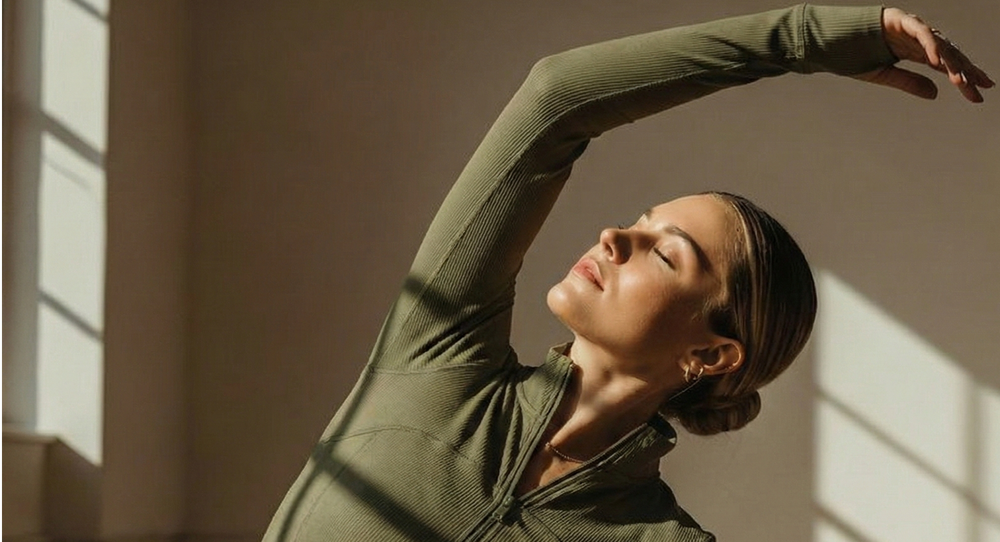

# ORA Pilates Studio — Landing Page

A multilingual landing page for ORA Pilates Studio, a modern pilates studio based in Başakşehir, Istanbul. Designed and developed by Baraa Juma Alaydi.



🌐 **Live:** [ora-pilates.vercel.app](https://ora-pilates.vercel.app)

---

## About the Project

ORA Pilates Studio needed a professional online presence to showcase their services and allow clients to book sessions easily. This landing page was designed and built from scratch — covering both UI/UX design and frontend development.

---

## Features

- **Multilingual support** — Full Turkish and Arabic translations with seamless language switching (TR / AR)
- **WhatsApp booking integration** — Clients can book sessions directly via WhatsApp with a pre-filled message including their name, phone, program, date, and time
- **Services showcase** — Dedicated sections for all studio programs: Mat Pilates, Reformer Pilates, EMS, Pregnancy Pilates, and Physiotherapy
- **Smooth scroll navigation** — Navbar with active section detection and smooth scrolling
- **Responsive design** — Optimized for desktop and mobile
- **Contact form** — Custom booking form with program selection, date/time picker, and consent checkbox
- **Brand-consistent UI** — Olive green and beige color palette with Cormorant Garamond typography

---

## Services Covered

| Service | Description |
|---|---|
| Mat Pilates | Core strength, flexibility, and posture |
| Reformer Pilates | Equipment-based deep muscle activation |
| EMS | Full-body electro-muscle stimulation (20 min sessions) |
| Pregnancy Pilates | Safe prenatal movement and breathing |
| Physiotherapy | Expert-led rehabilitation and mobility work |

---

## Tech Stack

| Technology | Usage |
|---|---|
| React 19 | UI framework |
| Vite | Build tool |
| Tailwind CSS v4 | Styling |
| React Context API | Language state management |
| WhatsApp API | Booking integration |

---

## Getting Started

```bash
# Clone the repository
git clone https://github.com/baraajuma3-lab/ora-pilates.git

# Install dependencies
cd ora-pilates
npm install

# Run locally
npm run dev

# Build for production
npm run build
```

---

## Design & Development

**Designed and developed by:** Baraa Juma Alaydi  
**Role:** UI/UX Designer + Frontend Developer  
**Responsibilities:**
- Full UI/UX design (layout, typography, color system, component design)
- Frontend development (React, Vite, Tailwind CSS)
- Multilingual architecture (Turkish & Arabic)
- WhatsApp booking flow integration
- Deployment on Vercel

---

## Project Structure

```
src/
├── components/
│   ├── Navbar.jsx
│   ├── Hero.jsx
│   ├── Services.jsx
│   ├── About.jsx
│   ├── MatPilates.jsx
│   ├── reformerpilates.jsx
│   ├── Ems.jsx
│   ├── Hamile.jsx
│   ├── Fizyoterapi.jsx
│   ├── Contact.jsx
│   └── Footer.jsx
├── LanguageContext.jsx
├── translations.js
├── App.jsx
└── main.jsx
```

---

© 2025 ORA Pilates Studio. Designed & built by Baraa Juma Alaydi.
